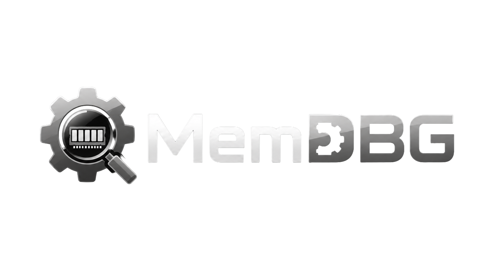

<div align="center">

<br/>



<br/>
<br/>

**Memory debugging and inspection suite for PS4 / PS5 research environments.**

<br/>

[](LICENSE)
[](#supported-platforms)
[](#repository-status)
[](#building)

<br/>

</div>

---

MemDBG is a high-performance memory debugging suite for PlayStation 4 and PlayStation 5 homebrew research. It pairs a compact, capability-aware wire protocol running on the console with a native Dear ImGui frontend, giving you a unified interface for process inspection, memory analysis, scanning, and cheat-trainer workflows — without compromising on speed or ergonomics.

> Intended for educational, research, preservation, and offline homebrew development purposes only.

<br/>

## Table of Contents

- [Highlights](#highlights)
- [Architecture](#architecture)
- [Features](#features)
- [Wire Protocol](#wire-protocol)
- [Supported Platforms](#supported-platforms)
- [Localization](#localization)
- [Building](#building)
- [Testing](#testing)
- [Workflow](#workflow)
- [Configuration](#configuration)
- [Release Pipeline](#release-pipeline)
- [Contributing](#contributing)
- [Ethical Use](#ethical-use)
- [Disclaimer](#disclaimer)
- [License](#license)

<br/>

## Highlights

- **Single-binary payload** for PS4 (Orbis) and PS5 (Prospero), plus a Linux/macOS host build for offline development.
- **Native desktop frontend** in C++17 with Dear ImGui, OpenGL, and GLFW — packaged as `.app` on macOS, `.exe` on Windows, and a `.desktop` entry on Linux.
- **Capability-aware protocol** — the frontend adapts gracefully to older or partial payloads without crashing.
- **Five scanner modes**: exact value, process-wide exact, process-wide AOB, pointer chain, unknown initial value, plus a heuristic **Smart Auto-Search** engine tuned for common game values (health, ammo, resources).
- **Non-blocking UI** — connect, scan, and telemetry requests run on worker threads and stream results back via `std::future` polling.
- **Repository-backed localization** — English is embedded, while additional languages are listed, downloaded, validated, and cached from the project repository.
- **Embeddable library target** (`libmemdbg.a`) for integrating the payload core into other tools.
- **Zero-config discovery** — payloads respond to UDP broadcasts so the frontend can auto-populate the console list without hardcoding a debug port.
- **Crash-resilient logging** — ring-buffered event log with signal-safe crash handlers; survives `SIGSEGV`/`SIGABRT`/`SIGFPE`/`SIGILL` and flushes to disk immediately. Captures frontend status, notifications, and UDP console logs.
- **DPI-aware UI** — auto-detects monitor content scale on startup and scales every widget, font, and layout proportionally for HiDPI / Retina displays.

<br/>

## Architecture

```
MemDBG
├── payload/                  C11 homebrew daemon (PS4, PS5, host)
│   ├── core/                 Engine, instance lifecycle, logging
│   ├── scanner/              Exact, AOB, pointer, unknown + process-wide variants
│   ├── debug/                Process / memory primitives shared by the scanner
│   ├── privilege/            Sandbox escape + per-process elevation
│   ├── telemetry/            UDP broadcast logger + discovery responder
│   └── pal/                  Platform abstraction (network, memory, fileio, notify, lz4)
├── libmemdbg.a               Static library target (PS4 / PS5) for embedded use
├── memdbg-host               Host validation build (same C sources, host toolchain)
└── frontend/                 C++17 + Dear ImGui desktop app
    ├── app/                  Window, sidebar, top bar, status bar, async dispatch
    ├── core/                 TCP client, UDP listener, GitHub profile loader
    ├── screens/              One file per screen (Home, Consoles, Processes, …)
    ├── scanner/              Auto-Search heuristic engine (mirrors backend semantics)
    ├── trainer/              .cht load/save, batchcode parser
    ├── locale/               English embedded i18n plus repository-backed language cache
    ├── ui/                   Reusable widgets, theme, fonts, icon font, file picker
    └── proto/                Standalone protocol probe CLI
```

The payload binds a TCP debug port and exposes process enumeration, map inspection, and memory primitives; it streams runtime logs over UDP. The frontend connects to the TCP endpoint, subscribes to telemetry, and renders the full interactive interface. Payloads advertise their capabilities via a bitmap in the `HELLO` response, so the frontend can hide unsupported features rather than erroring.

<br/>

## Features

### Scanner engine (payload-side)

- **Exact value scan** with type selection: `u8`, `u16`, `u32`, `u64`, `f32`, `f64`, raw bytes, pointer.
- **Process-wide exact scan** with protection-mask and address-range filtering.
- **Process-wide AOB scan** with wildcard bytes (`??`) in cheat-engine signature style.
- **Range AOB scan** for targeted byte-pattern searches.
- **Pointer scan** with configurable max depth, alignment, and alignment-aware dereference.
- **Unknown initial value scan** — snapshots every aligned value as a baseline for later refinement.
- **Resilient I/O** — scans continue past faulting pages, accumulate `read_errors`, and carry pending bytes across 1 MiB chunk boundaries so cross-chunk matches are never lost.

### Frontend screens

| Screen | What it does |
|---|---|
| **Home (Command Center)** | Dashboard tiles for every workflow; live session and UDP status; recent map/hit/cheat chips. |
| **Consoles** | Direct payload session management: connect, disconnect, ping, shutdown, and start/stop the UDP log listener from one place. |
| **Processes** | Refresh the process list (PID / name / Title ID / Content ID / path), inspect memory maps, filter by protection flags, hide system maps, set a minimum-size and dump cap, dump selected or filtered maps to disk, run a basic process analysis. |
| **Memory** | Address-range read/write with a hex view; byte-patch input; watchpoints (polling) with overlay marks; allocation tracking with importable event streams and double-free detection; **Exploit Lab** with ROP gadget finder and heap-spray entropy analyzer. |
| **Scanner** | Exact-value scan, process-wide scan, unknown initial value scan, refinement pipeline (changed / unchanged / increased / decreased), and **Smart Auto-Search** with target presets (Health / Ammo / Resources) and a scored candidate list. |
| **Pointer Scan** | Trace pointer chains back from a target address with adjustable depth and alignment. |
| **AOB Scan** | `48 8B ?? ??`-style pattern search with wildcards, process-wide or range mode, and per-map protection filtering. |
| **Trainer** | Build cheats (name, address, type, ON/OFF/lock); import batchcodes (`offset`, `value`, `size`, AOB tokens); capture OFF values from live memory; set per-entry lock intervals; save and load `.cht`-style trainer files. |
| **Logs** | Live UDP telemetry feed with start / stop / clear / copy; sender endpoint; bind-retry counter; received / dropped / evicted message stats. |
| **Telemetry** | Payload runtime metrics (requires `PERF_TELEMETRY` capability): uptime, active connections, thread-pool size, total read/write bytes and call counts, throughput, scan-map LRU cache hit/miss rate, last-poll age. |
| **Settings** | Persistent connection defaults (host, TCP debug port, UDP log port, dump directory), 8-language picker — written to the per-platform app config directory. |
| **Credits** | Creator info, GitHub avatar and handle loaded at runtime, license, donation and repository links. |

### Frontend ergonomics

- Global hotkeys: **F1** Home · **F5** Connect/Disconnect · **F6** Processes · **F7** Scanner · **F8** Memory · **F9** Trainer · **F10** Logs.
- Toast notifications with auto fade-out and manual dismiss.
- Sidebar grouped into **Main / Tools / Observe / System** sections.
- Top bar with live chips for session state, loaded maps, scan hits, and active cheats.
- Status bar showing FPS, session state, target PID, and UDP listener stats.
- File picker for dump directory and trainer file save/load.
- Embedded logo, native window icon (`.icns` macOS · `.ico` Windows · `.desktop` Linux), and a `ResizeToFit`-friendly layout that handles live window resize.
- Full Unicode font stack: base Latin + Cyrillic ranges in the primary font, with OS-specific CJK fallback chains (Apple SD Gothic Neo / Hiragino Sans GB on macOS, Malgun Gothic / Arial Unicode MS on Windows) for Japanese, Korean, and Chinese glyphs.
- DPI-aware rendering — monitor content scale is auto-detected via GLFW; all sizes, fonts, spacings, and rounding radii scale proportionally for crisp rendering on HiDPI displays.

<br/>

## Wire Protocol

A compact binary protocol (`MEMDBG_PACKET_MAGIC = "MDBG"`, little-endian, version 1). All multi-byte fields are packed. Payloads declare capabilities via the `HELLO` response bitmap, so the frontend stays forward-compatible with older or platform-specific builds.

### Limits

| Constraint | Value |
|---|---|
| Max packet size | 1 MiB |
| Max `MEMORY_READ` size | 1 MiB |
| `BATCH_READ` / `BATCH_WRITE` items per call | 64 |
| Max scan value payload | 16 bytes |
| Optional result compression | LZ4 (advertised via `MEMDBG_CAP_LZ4`) |

### Commands

| Code | Command | Purpose |
|---|---|---|
| `0x0001` | `HELLO` | Capability bitmap, platform ID, version, debug/UDP ports. |
| `0x0002` | `PING` | Liveness probe. |
| `0x0100` | `PROCESS_LIST` | Enumerate all PIDs. |
| `0x0101` | `PROCESS_MAPS` | Memory map list for a PID. |
| `0x0102` | `PROCESS_INFO` | Name, executable path, Title ID, Content ID. |
| `0x0103` | `FOREGROUND_APP` | Metadata for the currently focused application. |
| `0x0104` / `0x0105` | `PROCESS_STOP` / `PROCESS_CONTINUE` | Suspend / resume a target process. |
| `0x0200` / `0x0201` | `MEMORY_READ` / `MEMORY_WRITE` | Single-address I/O. |
| `0x0202` / `0x0203` | `BATCH_READ` / `BATCH_WRITE` | Multi-address I/O in one round-trip (used by Auto-Search and trainer lock writes). |
| `0x0300` / `0x0301` | `SCAN_EXACT` / `SCAN_PROCESS_EXACT` | Value scan, range or process-wide. |
| `0x0302` / `0x0305` | `SCAN_AOB` / `SCAN_PROCESS_AOB` | Byte-pattern scan, range or process-wide. |
| `0x0303` | `SCAN_POINTER` | Pointer-chain search. |
| `0x0304` | `SCAN_UNKNOWN` | Baseline every aligned value for later refinement. |
| `0x0400` | `TELEMETRY` | Runtime performance metrics. |
| `0x0500` | `DISCOVERY` | UDP broadcast ping/pong for console auto-detection. |
| `0x7f00` | `SHUTDOWN` | Clean payload termination. |

Every `SCAN_*` response opens with a `memdbg_scan_response_prefix_t` carrying hit count, truncation flag, bytes scanned, elapsed time, and read/region/error counts — the same numbers the frontend surfaces on screen.

<br/>

## Supported Platforms

| Platform | Status |
|---|---|
| PlayStation 5 | In development (`make payload-ps5`) |
| PlayStation 4 | In development (`make payload-ps4`) |
| Linux host | Supported |
| macOS host | Supported |
| Windows host + frontend | Supported |
| Frontend — Linux | Supported |
| Frontend — macOS | Supported (universal `.app` bundle) |
| Frontend — Windows | Supported (`.exe` + `.ico`) |

The frontend connects to the payload over TCP (default port `9020`). Telemetry and discovery use UDP (`9023` and `9022` respectively). The host build requires all three ports to be free at startup.

<br/>

## Localization

The UI is driven by JSON locale files in [`frontend/locales/`](frontend/locales). English (`en.json`) and `imgui.ini` are embedded at build time via `tools/embed_assets.py`; every other language is fetched from the repository through [`manifest.json`](frontend/locales/manifest.json), stored under the platform app data directory, validated, and preloaded on startup. When a cached language differs from the repository version or fails JSON validation, the frontend redownloads it before loading it into memory.

Adding a new language is as simple as dropping a `<code>.json` file, regenerating the manifest, and opening a PR — `make check-locales` will flag missing keys, stale manifest size/hash data, and format-string mismatches before the build ships.

| Code | Language | File |
|---|---|---|
| `en` | English | [`en.json`](frontend/locales/en.json) |
| `es` | Español | [`es.json`](frontend/locales/es.json) |
| `it` | Italiano | [`it.json`](frontend/locales/it.json) |
| `fr` | Français | [`fr.json`](frontend/locales/fr.json) |
| `pt` | Português | [`pt.json`](frontend/locales/pt.json) |
| `de` | Deutsch | [`de.json`](frontend/locales/de.json) |
| `ja` | 日本語 | [`ja.json`](frontend/locales/ja.json) |
| `ru` | Русский | [`ru.json`](frontend/locales/ru.json) |

```sh
make check-locales   # fails if any locale is missing a key present in en.json
python3 tools/generate_locale_manifest.py
```

<br/>

## Building

### Prerequisites

| Component | Requirement |
|---|---|
| C toolchain | C11-compatible (`cc` / `clang` / `gcc`) |
| C++ toolchain | C++17 with CMake 3.24+, Ninja recommended |
| PS5 payload | [`external/ps5-payload-sdk/`](external/ps5-payload-sdk) (override with `PS5_PAYLOAD_SDK=`) |
| PS4 payload | [`external/ps4-payload-sdk/`](external/ps4-payload-sdk) (override with `PS4_PAYLOAD_SDK=`) |
| Frontend | OpenGL, GLFW, ImGui, nlohmann/json, stb — all pulled in via CMake `FetchContent` |

Both payload SDKs ship with the repository; no extra clones needed.

### Console payloads

```sh
# PS5
make payload-ps5
make deploy-ps5 PS5_HOST=192.168.1.100 PS5_PORT=9021

# PS4
make payload-ps4
make deploy-ps4 PS4_HOST=192.168.1.100 PS4_PORT=9021
```

### Embeddable static library

```sh
make payload-ps5-lib    # → build/ps5/libmemdbg.a
make payload-ps4-lib    # → build/ps4/libmemdbg.a
```

Both archives include the scanner, debug, telemetry, PAL, and privilege modules but omit the `main.c` entry point, so they link cleanly into a custom payload shell.

### Host validation build

```sh
make host
./build/MemDBG-host --bind=0.0.0.0 --debug-port=9020 \
                    --udp-port=9023 --data-root=/tmp/MemDBG
```

The host build runs on Linux or macOS, opens real TCP/UDP sockets, and serves the identical protocol as the console payload — useful for unit tests, frontend development, and hardware bring-up without a console.

### Desktop frontend

```sh
make frontend
open build/frontend/bin/MemDBG.app        # macOS
./build/frontend/bin/memdbg_frontend      # Linux / non-bundle builds
```

On macOS this produces a `MemDBG.app` bundle with `Resources/assets/app-icon.png` and a custom `.icns` icon. On Linux a `MemDBG.desktop` file is placed alongside the binary.

### Protocol probe CLI

```sh
./build/frontend/memdbg_probe
```

A standalone CLI for exercising a payload without the GUI.

### Full verification matrix

```sh
make clean
make verify    # host + payload-ps4 + payload-ps5
```

<br/>

## Testing

```sh
make test-aob-boundary     # 17-case AOB pattern boundary suite
make test-process-aob-e2e  # End-to-end AOB scan against a live host payload
make test                  # Both of the above
```

- **`test_aob_boundary`** mocks the memory backend and map table to verify that the scanner correctly carries pending bytes across 1 MiB chunk boundaries, handles wildcards, applies the good-suffix shift, and survives faulting pages.
- **`test_process_aob_e2e`** spawns a real `MemDBG-host` on a temporary data root and walks the full `PROCESS_LIST → PROCESS_MAPS → SCAN_PROCESS_AOB` sequence. The test is self-contained and cleans up on exit.

The frontend CMake build also produces **`memdbg_auto_search_test`**, a unit test for the Auto-Search heuristic engine.

<br/>

## Workflow

A typical MemDBG session:

1. Build and deploy the payload (`make deploy-ps5` or `make deploy-ps4`).
2. Launch the frontend (`make frontend && ./build/frontend/memdbg_frontend`).
3. In **Consoles**, enter the console IP and ports, then press **Connect**.
4. In **Processes**, refresh the list and select a target — Title ID, Content ID, and executable path are all surfaced.
5. **Memory** — read/write raw bytes; place watchpoints to detect value changes; import allocation events to track heap lifetime.
6. **Scanner** — run an exact-value scan; change the value in-game; refine (changed / unchanged / increased / decreased) until the candidate list is short. Or use **Smart Auto-Search → Health / Ammo / Resources** for a heuristic pass.
7. **AOB Scan** or **Pointer Scan** to derive stable addresses that survive ASLR across sessions.
8. **Trainer** — build a cheat entry (name, address, type, ON/OFF values, lock interval), then save as a `.cht` file or import a batchcode string.
9. **Telemetry** — watch throughput and scan-cache hit rate to catch overly aggressive read patterns.
10. **Logs** (`F10`) — scroll the live UDP feed for console-side diagnostics.

<br/>

## Configuration

The frontend writes a `frontend.conf` to the per-platform config directory:

| OS | Path |
|---|---|
| Linux | `~/.config/MemDBG/frontend.conf` |
| macOS | `~/Library/Application Support/MemDBG/frontend.conf` |
| Windows | `%APPDATA%\MemDBG\frontend.conf` |

```ini
host=192.168.1.100
debug_port=9020
udp_port=9023
dump_path=dumps
language=en
```

A static user guide is published via **GitHub Pages** from [`github-pages/`](github-pages) — deploy that directory as the Pages root for a full HTML/CSS walkthrough covering default ports, connection setup, scanner usage, trainer workflow, and troubleshooting.

Host build CLI flags:

| Flag | Purpose |
|---|---|
| `--bind=0.0.0.0` | TCP bind address. |
| `--debug-port=9020` | TCP port the frontend connects to. |
| `--udp-port=9023` | UDP port for telemetry and discovery. |
| `--data-root=/tmp/MemDBG` | Working directory for logs and dumps. |
| `--no-udp-log` | Disable UDP log delivery (discovery still responds). |
| `--no-replace-existing` | Refuse to overwrite an already-running payload instance. |

<br/>

## Release Pipeline

Every tag (`v*`) or manual `workflow_dispatch` triggers a matrix build of seven artifacts:

| Job | Artifact |
|---|---|
| `host-linux` | `MemDBG-host-linux` |
| `host-macos` | `MemDBG-host-macos` |
| `frontend-linux` | `MemDBG-frontend-linux` |
| `frontend-macos` | `MemDBG-frontend-macos.app.zip` |
| `frontend-windows` | `MemDBG-frontend-windows.zip` |
| `payload-ps4` | `MemDBG-ps4.elf` + `libmemdbg-ps4.a` |
| `payload-ps5` | `MemDBG-ps5.elf` + `libmemdbg-ps5.a` |

`make check-locales` and both scanner tests run as part of the `host-linux` job, so a release can only complete when locales are complete and all scanner tests pass. Artifacts are uploaded to the GitHub Release alongside a `SHA256SUMS.txt`.

<br/>

## Repository Status

Pre-release / active development. Wire protocol is version `1`; breaking changes are discussed before bumping.

**Completed:**
- ✅ Console process / map / memory primitives, all scan types, batch I/O, telemetry, discovery.
- ✅ Native desktop frontend on Linux, macOS, Windows, with full localization.

**In progress:**
- 🛠 Pointer chain tooling and extended trainer formats (relative / pointer trainers, GoldHEN JSON) — tracked in [`docs/feature_research.md`](docs/feature_research.md).
- 🛠 Native debugger tooling (attach / detach, breakpoints, disassembler) — tracked in the same document.

<br/>

## Contributing

Contributions are welcome once the project reaches its first public development milestone.

Open contribution areas:

- **UI** — Dear ImGui panels, layout, theming, accessibility.
- **Scanner** — SIMD paths, parallelism, additional filtering modes.
- **Backend integration** — new payload protocols or platform ports.
- **Translations** — drop a `<code>.json` under `frontend/locales/`, run `python3 tools/generate_locale_manifest.py`, and open a PR; `make check-locales` guides you.
- **Bug reports and feature proposals** — via GitHub Issues.

Please review the project goals and ethical guidelines before opening a pull request.

<br/>

## Ethical Use

MemDBG is built for legitimate debugging, security research, education, and homebrew development.

**Not intended for:**

- Online cheating or multiplayer advantage.
- Piracy or circumventing paid content.
- Accessing systems or software without authorization.
- Attacking third-party services or disrupting online play.

The maintainers do not support and will not assist with any of the above.

<br/>

## Disclaimer

This project is provided for educational and research purposes only. The authors and contributors accept no responsibility for misuse, hardware or software damage, account actions, legal consequences, or violations of third-party terms of service.

Use at your own risk, on hardware and software you own or are authorized to analyze.

<br/>

## License

GPL-3.0-or-later — see [LICENSE](LICENSE).

<br/>

---

<div align="center">

**MemDBG** — `mem` + `DBG` — memory debugging for PS4 / PS5 research.

</div>
